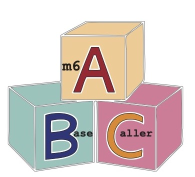

# m6ABasecaller



Welcome to the m6ABasecaller GitHub repo!! 

The m6ABasecaller allows to directly base-call m6A RNA modifications in **individual reads**, with **single nucleotide resolution**, from direct RNA sequencing nanopore raw FAST5 files, without the need of paired 'control' conditions (knockout, knockout, etc). 


## Table of contents
- [General Description](#General-description)
- [Installation](#Installation)
- [Running the code](#Running-the-code)
- [Dependencies and versions](#Dependencies-and-versions)
- [Citation](#Citation) 
- [Contact](#Contact) 


## General Description
The m6ABasecaller is an modification-aware RNA basecalling model that predicts 5 nucleosides (A,C,G,U,m6A) compared to canonical RNA basecalling models, which give as output 4 nuclesodies (A,C,G,U). 

The RNA basecalling model can be used directly with Guppy. Alternatively, it can be fed to [ModPhred](https://modphred.readthedocs.io/en/latest/), which facilitiates the storage and downstream analysis of RNA modification data from nanopore sequencing datasets. 

This repo includes command line examples and scripts to: 
* 1. Use the m6A-modification-aware RNA basecalling model (which we refer to as **m6ABasecaller** for simplicity). 
* 2. Analyze the output generated by [modPhred](https://github.com/novoalab/modPhred) (ie. in this work, the RNA modification information was extracted by modPhred).


## Installation 

Please follow the instructions on how to install modPhred [here](https://modphred.readthedocs.io/en/latest/install.html).

## Running the code

Download the basecalling model rna_r9.4.1_70bps_m6A_hac.cfg and place it in your guppy folder at ont-guppy/data/. Then:


#### a) Option 1 --  All-in-one step solution: Base-call, store modification information and map with ModPhred (recommended option)
Here we use the tool [ModPhred](https://github.com/novoalab/modPhred) to base-call, encode m6A RNA modification and map the reads in a simple, and efficient manner, with a single command, making it very simple for the user to use alternative basecalling models.  ModPhred performs the base-calling step using Guppy. The data is stored both in the FASTQ and BAM files, in the QUALITY INFORMATION. please note that with this option you are not going to save basecalled fast5 files! 

Usage: 
```
-c: config for guppy, containing the m6A basecaller model. (for m6A basecaller: rna_r9.4.1_70bps_m6A_hac.cfg)
--host: path to your guppy_basecall_server
-f: your reference.fa file
-o: path to output folder
-i: path to input folders (containing the fast5 files). You can provide >=1 input folders

module load Singularity/3.2.1
singularity exec --nv modPhred/modphred-3.6.1.sif modPhred/run -c ont-guppy/data/rna_r9.4.1_70bps_m6A_hac.cfg --host soft/ont-guppy/bin/guppy_basecall_server -f reference.fa -o m6A_basecaller -i path/to/sample1  path/to/sample2  path/to/sample3 

```

For more details on how to use ModPhred, please see the [GitHub](https://github.com/novoalab/modPhred) repository and the [ReadTheDocs](https://modphred.readthedocs.io/en/latest/install.html) manual.

#### b) Option 2 -- Base-call with Guppy 
You may use this model standalone with Guppy, and then use megalodon or ModPhred to extract and process the RNA modification information. Please note that if you use megalodon, your RNA modification information will be encoded in the form of SAM tags. If you use ModPhred, your RNA modification information will be encoded in the quality of the FASTQ and BAM. (future version of ModPhred will allow to encode modification information directly in SAM tags). In this work, all data was basecalled with Guppy 3.4.5.

Usage: 
```
guppy_basecaller –i path/to/sample/fast5 –s path/to/sample/output –c ont-guppy/data/rna_r9.4.1_70bps_m6A_hac.cfg
```

## Dependencies and versions

Software | Version 
--- | ---
ModPhred | 1.0b
venn | 0.1.3
pybedtools | 0.8.1
meme | 4.11.2

## Citation
  
If you find this work useful, please cite: 

Cruciani S*, Delgado-Tejedor A*, Pryszcz LP*, Medina R, Llovera L and Novoa EM. De novo basecalling of m6A  modifications at single-molecule and single-nucleotide resolution. BioRxiv 2023 (under review). 
  
## Contact
If you have any issues running this code, please go first over previous [issues](https://github.com/novoalab/m6ABasecaller/issues). If you still can't figure it out based on the prior responses/issues raised, please open a new issue. Thanks!   
